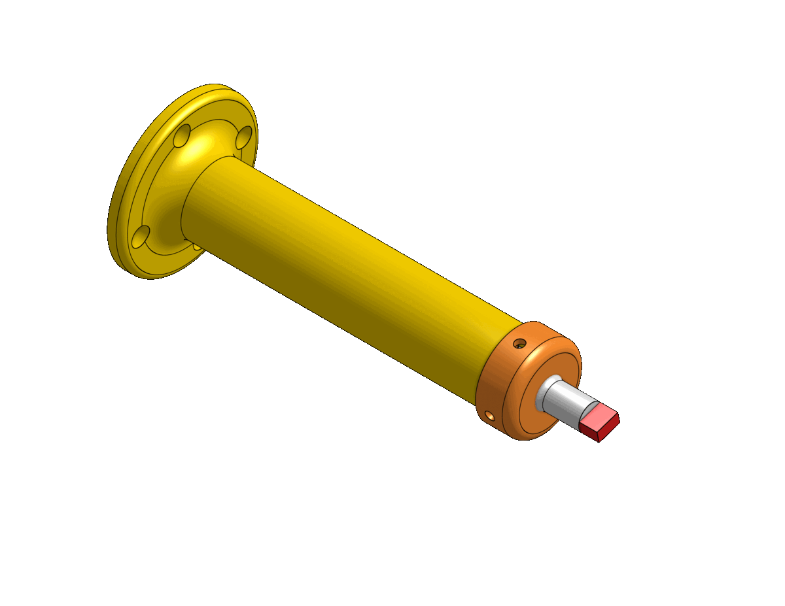

# robotics-abbIRB140
Repositoty for practices with an industrial robot model ABB IRB140

---
# Tool Design
- Medidas segun el manual
- Describir la herramienta (partes, resorte)

  

  <a target="_blank" href="https://cad.onshape.com/documents/02a2a5fe444c220951f7859a/w/4de4b01172907f48fb48adbe/e/481b6444fafd2e1357d20adc">
  Visualize CAD model with OnShape
  </a>

|   |   |
|---|---|
| __mass__ | $34g$ (parts) + $70g$ (marker) |
| __center of gravity__ | $[0, 0, 61]$ $\text{mm}$ |
| __TCP__ | $[0, 0, 145]$ $\text{mm}$ |

---
# Tool Calibration
- Procedimiento
- GIF con 4 posiciones
- Medidas con calibracion vs. medidas con modelo

---
# Simulation
Before any application on an industrial robot, it's mandatory to simulate the process to ensure that all paths the robot will make are safe. For this simulation stage we use [RobotStudio®](https://new.abb.com/products/robotics/robotstudio) software, following these steps:

1. Create a new station and add the robot model [ABB - IRB140](https://new.abb.com/products/3HAC020536-001/irb-140), the created tool (modeled in the _Tool Design_ section) and the work object with the surface to write to. Both tool and object models are imported in `.sat` format (available at [/models](./models) folder).

2. Configure <b>TCP</b> (Tool Center Point) by adding the position and orientation offset with respect to the `tool0` frame. This offset can be obtained from the tool model or via tool calibration as described in the previous section.

3. Generate path with the `AutoPath` tool. It is possible to set the tolerance, the speed and the correction for reduced angles.

4. Create midway points to ensure a safe trajectory for the robot as it approaches to the designed path.

5. Create subroutine on RAPID code by calling the different PROCEDURES into the `main()` function. RobotStudio will create the constants for every targed used in the different paths and will also write every path as an isolated procedure. The final RAPID code is available inside the [/code](./code/Module1.mod) folder.

https://user-images.githubusercontent.com/55401093/188253709-890514b5-370a-47eb-8e7b-e0c88d74943e.mp4

---
# Demonstration

https://user-images.githubusercontent.com/55401093/188254255-55779791-179b-4d6a-8675-2d9d4596900a.mp4

---
# Conclusions
- 
